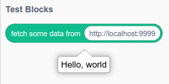

# Scratch Extension Development

## Setup Local Development
```bash
# Install VM - the logic part. Sends state to the GUI
git clone https://github.com/LLK/scratch-vm.git 
nvm use			# if using nvm for node version management
npm link

# Install GUI - the visual part
git clone https://github.com/LLK/scratch-gui.git 
cd scratch-gui
npm install
npm link scratch-vm	# use your local version
npm start		# see localhost:8601
```

## Writing an Extension
Setup an extension using the extension guide:
[Extension Guide](https://github.com/scratchfoundation/scratch-vm/blob/develop/docs/extensions.md)

Your extension should live under `scratch-vm/src/extensions/scratch3_myId/index.js` where `myId` is the name of your extension.

In `scratch-vm/src/extension-support/extension-manager.js` add:
```js
const builtinExtensions = {
	...
    myId: () => require('../extensions/scratch3_myId')
};
```

In `scratch-gui/src/lib/libraries/extensions/index.jsx`, add your extension to the `export default` list. You can copy an existing example, but it is import that the `extensionId` field matches `myId` above.

## Minimal Example

1. Take the example extension from `extension.js`, move it to `scratch-vm/src/extensions/scratch3_test/index.js`
2. Add the following to `scratch-vm/src/extension-support/extension-manager.js`
```js
const builtinExtensions = {
	...
    test: () => require('../extensions/scratch3_test')
};
```
3. Add the following to exported array at the end of `scratch-gui/src/lib/libraries/extensions/index.jsx`
```js
 {
        name: (
            <FormattedMessage
                defaultMessage="Test blocks"
                description="Name for the 'Test Blocks' extension"
                id="gui.extension.testBlocks.name"
            />
        ),
        extensionId: 'test',
        iconURL: musicIconURL,
        insetIconURL: musicInsetIconURL,
        description: (
            <FormattedMessage
                defaultMessage="Test things"
                description="Description for the 'Test Blocks' extension"
                id="gui.extension.testBlocks.description"
            />
        ),
        featured: true
    },
```
4. Run `scratch-gui` with `npm start`
5. (Optional) Run the local API with `go run main.go`. This should print "Hello, world!" at http://localhost:9999
6. Use the extension:
    - Go to http://localhost:8601/
    - Add an extension in the bottom left
    - Add the "Test Blocks" extensions
    - Open the "Test blocks" set of blocks on the left
    - Click "fetch some data from http://localhost:9999". You can change the URL to whatever you like.



## Running In a Browser

https://sheeptester.github.io/scratch-gui can be used to run scratch extensions without running scratch in development locally. See the [source](https://github.com/SheepTester/scratch-gui) for more information.

`extension-sheeptester.js` shows the differences needed in the extension file. This file needs to be hosted somewhere (you can use GitHub pages for that using this [simple tutorial](https://www.linkedin.com/pulse/quick-hack-hosting-files-github-jc-lee/)).

As an example, `extension-sheeptester.js`is hosted on the GitHub pages for this repository [here](https://coderdojobrighton.github.io/scratch-extension-tutorial/extension-sheeptester.js), and can be run in the browser by going to https://sheeptester.github.io/scratch-gui/?url=https://coderdojobrighton.github.io/scratch-extension-tutorial/extension-sheeptester.js

## Other Resources
- [Video for dev setup](https://www.youtube.com/watch?v=KsnIUs4Fmx0&t=993s)
- [Linking tutorial](https://scratch.mit.edu/discuss/m/topic/607994/)
